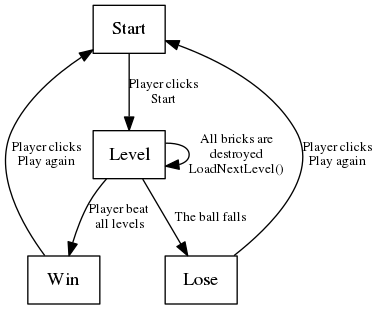
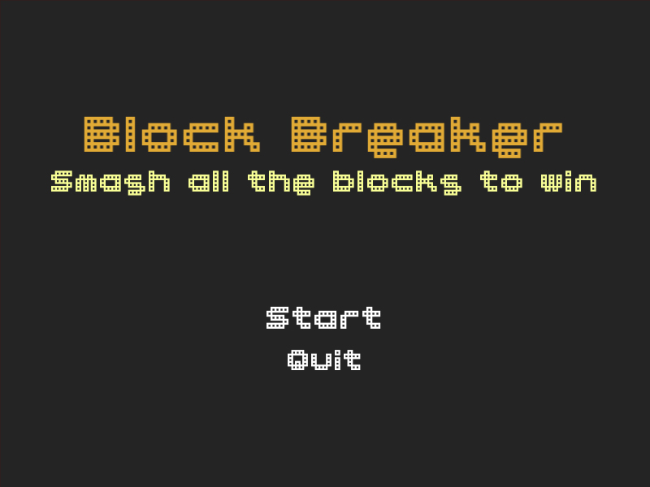
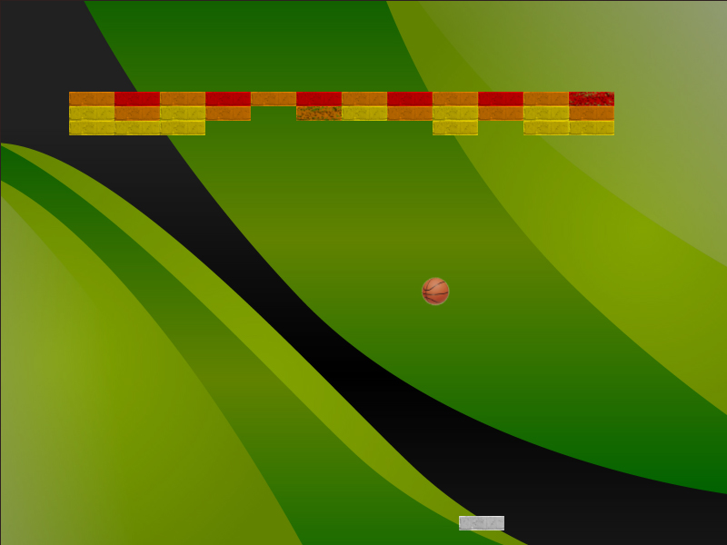
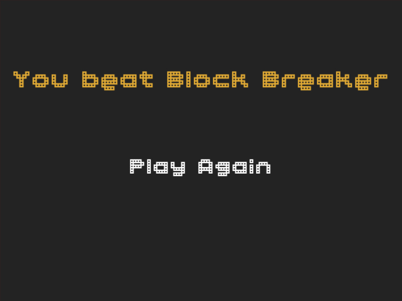
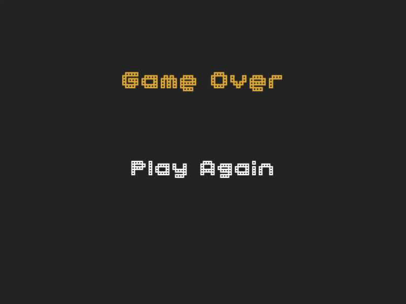

# BlockBreaker

##Description

The player has to prevent that the ball fall, moving a paddle horizontally, attempting to bounce it against a number of bricks.

##Tecnologies used
- Unity 5.3.1
- MonoDevelop 5.9.6
- Gimp 2.8.16

##Algorithms

##Scenes

###Start

###Game

###Win

###Lose

##Assets

- The sounds were gathered from http://www.freesound.org/ with Creative Commons 0 license.
- The images were gathered from Google Images, labeled for reuse with modifications.
